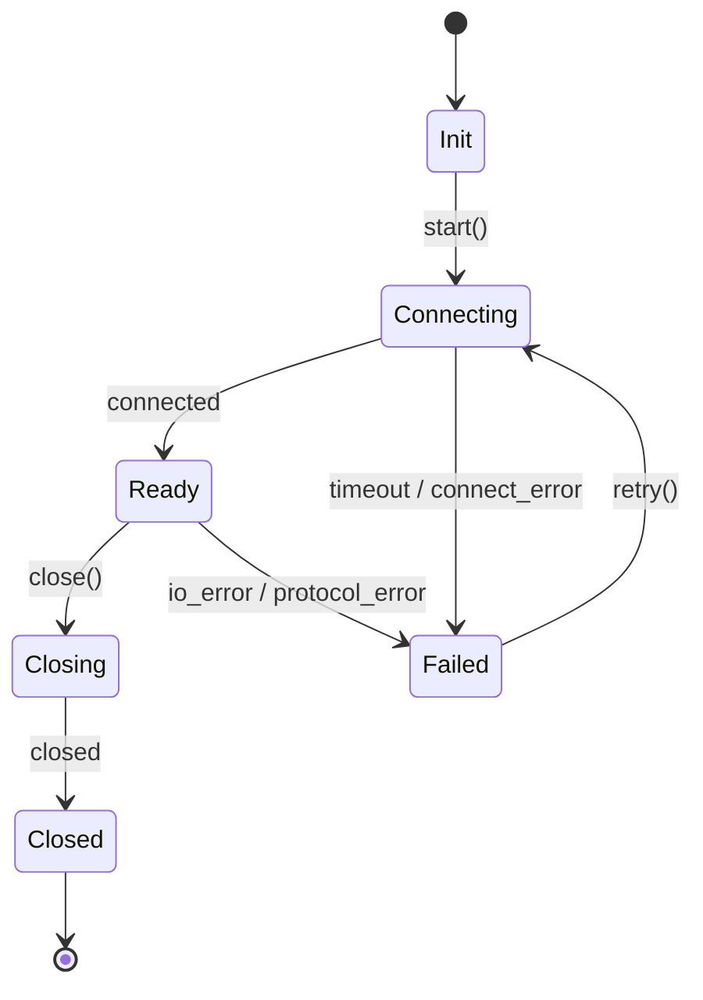

# Design RFC Template

このテンプレートは、`rgz-transport`の設計変更をレビュー可能な形で残すための雛形です。  
特に以下3項目を必須で定義します。

- 状態遷移図
- チャネル容量
- 失敗時の戻り値

---

## 1. Overview

- RFC ID: `RFC-YYYYMMDD-xxx`
- タイトル:
- 作成者:
- ステータス: `Draft | Review | Accepted | Rejected | Superseded`
- 対象crate: `rgz-transport | rgz-msgs | rgz-derive`
- 関連Issue/PR:
- 想定リリース:

### 背景

（なぜ必要か。現状の制約や障害、運用上の課題を書く）

### ゴール

- 
- 

### Non-goals

- 
- 

---

## 2. Public API / 互換性

### 変更対象API

| API | 変更種別 | 互換性 | 説明 |
| --- | --- | --- | --- |
| `foo()` | Add / Change / Remove | Backward Compatible / Breaking | |

### 互換性方針

- SemVer影響:
- 既存呼び出し側への影響:
- 移行手順:

---

## 3. 状態遷移図（必須）

### 状態一覧

| 状態名 | 説明 | 受理イベント |
| --- | --- | --- |
| `Init` | 初期状態 | `start` |
| `Connecting` | 接続試行中 | `connected`, `timeout`, `cancel` |
| `Ready` | 通信可能 | `send`, `recv`, `close`, `io_error` |
| `Closing` | クローズ処理中 | `closed` |
| `Closed` | 終了状態 | なし |
| `Failed` | 異常終了 | `retry`, `close` |

### 遷移図（Mermaid）



### 遷移ルール

- 禁止遷移:
  - `Closed -> Ready` は不可
  - `Init -> Ready` は不可
- 遷移時の副作用:
  - `Init -> Connecting`: チャネル初期化、監視タスク起動
  - `Ready -> Closing`: 新規送信停止、フラッシュ開始
  - `* -> Failed`: エラーメトリクス加算、詳細ログ出力

### 実装マッピング

| 概念状態 | 実装上の型/enum | 所在ファイル |
| --- | --- | --- |
| `Ready` | `ConnectionState::Ready` | `crates/rgz-transport/src/...` |

---

## 4. チャネル容量（必須）

### 対象チャネル一覧

| チャネル名 | 方向 | 容量 | オーバーフロー時 | 根拠 |
| --- | --- | ---: | --- | --- |
| `tx_outbound` | app -> transport | `1024` | `Error` | ピーク1秒分 |
| `rx_inbound` | transport -> app | `2048` | `DropOldest` | 遅延吸収 |

### 容量設計

- 想定ピークレート: `____ msg/s`
- 想定最大処理遅延: `____ s`
- 基本式: `capacity >= peak_rate * max_processing_delay`
- バースト係数: `x____`
- 最終容量決定理由:

### バックプレッシャ方針

- 送信側API挙動:
  - `send`: `Block | TrySend | Timeout`
- 運用観測:
  - `queue_len`
  - `queue_full_count`
  - `drop_count`
  - `send_block_time_ms`

### テスト計画

- 負荷試験条件:
- 期待SLO（遅延/ドロップ率）:
- 受け入れ基準:

---

## 5. 失敗時の戻り値（必須）

### エラー分類

| エラー種別 | retry可否 | 代表例 | 呼び出し側アクション |
| --- | --- | --- | --- |
| `Timeout` | Yes | 応答タイムアウト | 指数バックオフ再試行 |
| `TemporaryUnavailable` | Yes | 一時的ネットワーク断 | 短時間再試行 |
| `InvalidState` | No | `Closed`状態で`send` | 呼び出し順修正 |
| `ProtocolMismatch` | No | バージョン不一致 | 設定/バージョン確認 |
| `InvalidArgument` | No | サイズ超過 | 入力修正 |

### API別戻り値仕様

| API | 成功時 | 失敗時 (`Result<T, E>`) | 補足 |
| --- | --- | --- | --- |
| `connect()` | `ConnectionHandle` | `TransportError` | |
| `send(msg)` | `()` | `TransportError` | |
| `recv()` | `Message` | `TransportError` | |
| `close()` | `()` | `TransportError` | |

### エラーハンドリング規約

- `E`は機械判定可能な分類を持つ（例: `is_retryable()`）
- ログ方針:
  - retryable: `warn`
  - non-retryable: `error`
- メトリクス方針:
  - `errors_total{kind=...}`
  - `retries_total{kind=...}`

### 代表実装（例）

```rust
pub type TransportResult<T> = Result<T, TransportError>;

#[derive(Debug)]
pub enum TransportError {
    Timeout,
    TemporaryUnavailable,
    InvalidState,
    ProtocolMismatch,
    InvalidArgument(String),
}

impl TransportError {
    pub fn is_retryable(&self) -> bool {
        matches!(self, Self::Timeout | Self::TemporaryUnavailable)
    }
}
```

---

## 6. 代替案

| 案 | 採否 | 理由 |
| --- | --- | --- |
| A | 採用 | |
| B | 不採用 | |

---

## 7. テスト / 検証

- Unit test:
- Integration test:
- Benchmark:
- Failover/Chaos test:

---

## 8. Rollout / 運用

- Feature flag:
- 段階的有効化手順:
- 監視項目:
- ロールバック条件:

---

## 9. Open Questions

- 
- 

---

## 10. Review Checklist

- [ ] 状態遷移図に失敗経路と禁止遷移がある
- [ ] すべての状態で受理イベントが定義されている
- [ ] チャネル容量の根拠（計算式・ピーク想定）がある
- [ ] オーバーフロー時ポリシーが明示されている
- [ ] APIごとの`失敗時戻り値`が定義されている
- [ ] retry可否が機械判定できる
- [ ] ログ/メトリクス方針が定義されている
- [ ] 互換性と移行手順が明記されている

