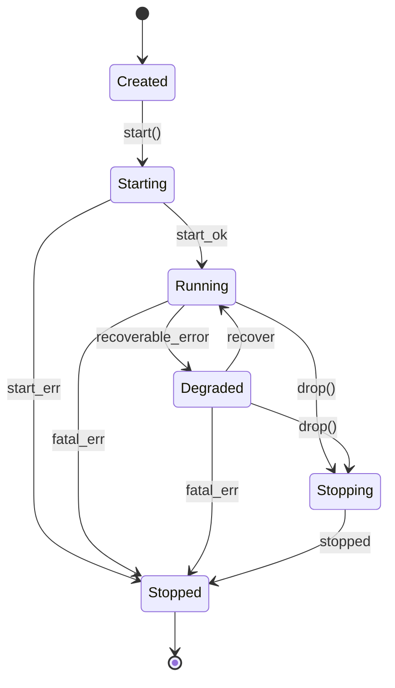
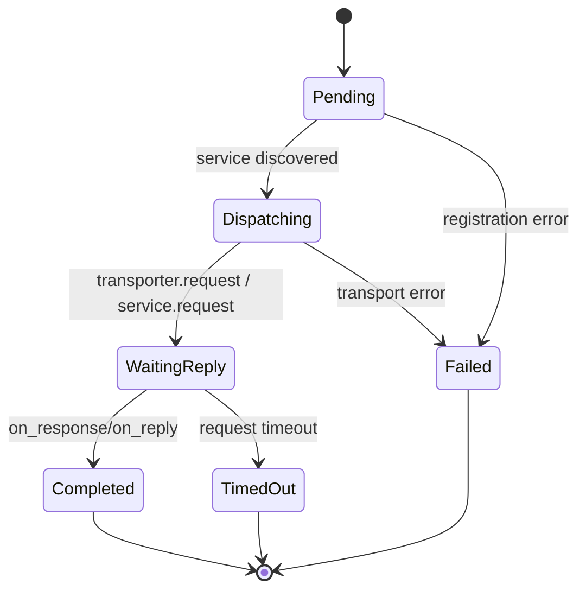

# RFC-20260305-001 Node Event Loop Reliability

- RFC ID: `RFC-20260305-001`
- タイトル: `NodeShared/Transporter の状態遷移明確化・チャネル容量設計・失敗戻り値の構造化`
- 作成者: `codex`
- ステータス: `Review`
- 対象crate: `rgz-transport`
- 関連Issue/PR: `TBD`
- 想定リリース: `v0.x (次期マイナー)`

## 1. 背景

`rgz-transport` の中核は、`NodeSharedInner::run` のイベントループと `Transporter::start` のI/Oスレッドで構成される。  
現在の実装では以下の課題がある。

- 状態遷移がコードに暗黙化され、起動失敗時やチャネル切断時の挙動が仕様として整理されていない
- `tokio::sync::mpsc::unbounded_channel` と `std::sync::mpsc::channel` を多用しており、負荷時の上限が設計で明示されていない
- 失敗戻り値が `anyhow::Result` とログ出力中心で、呼び出し側の再試行可否判定が難しい

対象コード:

- `crates/rgz-transport/src/node/shared.rs`
- `crates/rgz-transport/src/node/node.rs`
- `crates/rgz-transport/src/transport.rs`

## 2. ゴール / Non-goals

### ゴール

- Node/Transport のライフサイクル状態をRFCとして固定する
- チャネル容量とオーバーフロー時方針を定義し、観測可能にする
- 失敗時戻り値を分類し、API利用側が retry 可否を機械判定できるようにする

### Non-goals

- ZMQプロトコル仕様の変更
- 外部公開APIの大規模再設計
- 1回のPRで全経路を完全置換すること

## 3. Public API / 互換性

| API | 変更種別 | 互換性 | 説明 |
| --- | --- | --- | --- |
| `Publisher::publish` | Change | Breaking候補 | `anyhow::Result<()>` から `TransportResult<()>` へ段階移行 |
| `Node::request` | Change | Breaking候補 | タイムアウト/サービス失敗を構造化エラーへ移行（Phase 1では `Option<RES>` を維持） |
| 内部 `NodeShared`/`Transporter` | Change | Backward Compatible | 内部状態管理とメトリクスの拡張 |

移行方針:

- Step 1: `anyhow` を維持しつつ `TransportError` を `thiserror` で導入
- Step 2: 公開APIで `TransportResult<T>` を返す**新メソッド名**を追加
  - 例: `publish_typed`, `request_typed`
  - Rustでは同名オーバーロードはできないため、メソッド名で段階移行する
- Step 3: 既存戻り値を非推奨化

## 4. 状態遷移図（必須）

### 4.1 NodeShared ライフサイクル

状態一覧:

| 状態名 | 説明 | 受理イベント |
| --- | --- | --- |
| `Created` | `NodeShared::new` 後、未起動 | `start` |
| `Starting` | `NodeSharedInner::new` と各コンポーネント起動中 | `start_ok`, `start_err` |
| `Running` | `select!` ループ稼働中 | `discovery_event`, `node_event`, `transport_event`, `fatal_err`, `drop` |
| `Degraded` | 継続可能だが一部経路失敗（例: queue drop継続、send失敗連続） | `recover`, `fatal_err`, `drop` |
| `Stopping` | `Drop` で `JoinHandle::abort` 実行中 | `stopped` |
| `Stopped` | 終了 | なし |



禁止遷移:

- `Stopped -> Running` は不可（再起動は新インスタンス作成）
- `Created -> Running` は不可（`Starting` を経由）

`Degraded` 判定基準（初期値）:

- 10秒窓で `queue_dropped_total{queue in [discovery_events, transport_events]}` が `>= 100`
- 10秒窓で `TemporaryTransport` が `>= 50`
- 上記が解消して 30秒連続で閾値未満なら `Running` に復帰

### 4.2 Service Request 状態遷移

| 状態名 | 説明 |
| --- | --- |
| `Pending` | `pending_requests` 登録済み |
| `Dispatching` | `send_pending_remote_reqs` または local service に送出中 |
| `WaitingReply` | `response_dispatchers` に存在 |
| `Completed` | reply受信済み |
| `TimedOut` | `Node::request` timeout |
| `Failed` | 送信不可/dispatcher不整合 |



## 5. チャネル容量（必須）

### 5.1 現状

- Node内部イベント:
  - `discovery_event_sender/receiver`: `tokio::mpsc::unbounded_channel`
  - `node_event_sender/receiver`: `tokio::mpsc::unbounded_channel`
  - `transport_event_sender/receiver`: `tokio::mpsc::unbounded_channel`
- Transporterスレッド連携:
  - `subscribe_evt_sender/receiver`: `std::sync::mpsc::channel`（実質無制限）
  - `reply_msg_sender/receiver`: `std::sync::mpsc::channel`（実質無制限）
- ZMQ HWM:
  - `DEFAULT_SND_HWM = 1000`
  - `DEFAULT_RCV_HWM = 1000`

### 5.2 提案容量

| チャネル名 | 方向 | 容量 | オーバーフロー時 | 根拠 |
| --- | --- | ---: | --- | --- |
| `discovery_events` | callback -> node loop | `2048` | `try_send` 失敗時 `DropNewest + warn` | 接続/切断 burst 吸収 |
| `node_events` | API -> node loop | `1024` | `Error(NodeBusy)` | 呼び出し側へ即時通知 |
| `transport_events` | I/O -> node loop | `2048` | `try_send` 失敗時 `DropNewest + metric` | 受信burst対策 |
| `subscribe_events` | node loop -> transport thread | `512` | `Error(Backpressure)` | 接続操作は再送可能 |
| `reply_events` | node loop -> transport thread | `1024` | `Error(Backpressure)` | 応答喪失を防ぐため明示失敗 |

容量算定の初期前提:

- 想定ピークレート: `500 msg/s`
- 最大処理遅延: `2 s`
- 基本式: `capacity >= peak_rate * max_processing_delay`
- バースト係数: `x2`
- 例: `500 * 2 * 2 = 2000` 近傍を切り上げて `2048`

### 5.3 バックプレッシャ方針

- `NodeEvent` は `tokio::mpsc::Sender::try_send` を基本にし、満杯時は `NodeBusy` を返す
- `DiscoveryEvent` / `TransportEvent` は `try_send` 失敗時に `DropNewest` とし、ドロップ数をメトリクス化
- `DropOldest` は標準channelでは直接サポートされないため、本RFC初版では採用しない
- 将来 `DropOldest` が必要な場合は ring-buffer ラッパ（固定長 `VecDeque`）を別RFCで導入する
- メトリクス:
  - `rgz_transport_queue_len{queue=*}`
  - `rgz_transport_queue_dropped_total{queue=*}`
  - `rgz_transport_queue_full_total{queue=*}`

## 6. 失敗時の戻り値（必須）

### 6.1 エラー分類（提案）

| エラー種別 | retry可否 | 代表例 | 呼び出し側アクション |
| --- | --- | --- | --- |
| `Timeout` | Yes | `Node::request` timeout | backoff再試行 |
| `NodeBusy` | Yes | 内部キュー満杯 | ジッター付き再試行 |
| `TemporaryTransport` | Yes | 一時的なZMQ接続失敗 | 再接続後再試行 |
| `InvalidState` | No | `Publisher not ready` | 状態確認後実行 |
| `Serialization` | No | encode/decode失敗 | データ/型定義修正 |
| `ServiceNotFound` | 条件付き | 対応サービス未発見 | discover待機 or fallback |
| `Internal` | No | lock poison等の整合性問題 | ログ収集・復旧処理 |

### 6.2 API別戻り値仕様（提案）

| API | 成功時 | 失敗時 | 補足 |
| --- | --- | --- | --- |
| `Publisher::publish` | `()` | `TransportError::InvalidState | NodeBusy | TemporaryTransport` | 送信前提のready判定を維持 |
| `Node::request` | `Option<RES>` | `TransportError::Timeout | NodeBusy | Serialization | ServiceNotFound | Internal` | `None` は service側の `result=false` を維持（Phase 1） |
| `Node::subscribe` | `()` | `TransportError::NodeBusy | Internal` | 登録失敗を明示 |
| `Node::advertise_service` | `()` | `TransportError::NodeBusy | Internal` | service登録失敗を明示 |

`Node::request` の判定規則（Phase 1）:

- `Ok(Some(res))`: 正常応答 (`result=true`)
- `Ok(None)`: service が `result=false` を返した
- `Err(ServiceNotFound)`: 発見待ち上限（例: `discover_timeout`）を超過
- `Err(Timeout)`: 発見済みだが応答待ち超過

### 6.3 Rust型イメージ

```rust
pub type TransportResult<T> = Result<T, TransportError>;

#[derive(Debug, thiserror::Error)]
pub enum TransportError {
    #[error("request timed out")]
    Timeout,
    #[error("node event queue is full")]
    NodeBusy,
    #[error("temporary transport error: {0}")]
    TemporaryTransport(String),
    #[error("invalid state: {0}")]
    InvalidState(&'static str),
    #[error("serialization error: {0}")]
    Serialization(String),
    #[error("service not found: {0}")]
    ServiceNotFound(String),
    #[error("internal error: {0}")]
    Internal(String),
}

impl TransportError {
    pub fn is_retryable(&self) -> bool {
        matches!(
            self,
            Self::Timeout | Self::NodeBusy | Self::TemporaryTransport(_) | Self::ServiceNotFound(_)
        )
    }
}
```

## 7. 代替案

| 案 | 採否 | 理由 |
| --- | --- | --- |
| すべて現状維持（unbounded + anyhow） | 不採用 | 負荷時挙動が不透明で運用観測しにくい |
| 先に戻り値だけ型付け | 条件付き | 小変更だが容量課題は残る |
| 本RFC（状態 + 容量 + 戻り値を一体設計） | 採用候補 | 設計整合性と段階導入を両立 |

## 8. 検証計画

- Unit test:
  - 状態遷移の禁止経路テスト
  - キュー満杯時に `NodeBusy` が返ること
- Integration test:
  - pub/sub burst 時の drop/backpressure の期待動作
  - request/reply timeout のエラー分類
- Benchmark:
  - 64/1024/8192 byte メッセージで queue 指標比較
- Chaos:
  - discovery disconnect を断続注入し、`Degraded -> Running` 回復確認

## 9. Rollout

- Phase 1: 内部メトリクス追加（挙動不変）
- Phase 2: bounded channel を feature flag で導入
- Phase 3: `TransportError` を内部導入し `anyhow` から段階置換
- Phase 4: 公開APIで構造化エラーをデフォルト化

ロールバック条件:

- `queue_dropped_total / queue_in_total` が基準比 `+20%` 超を 15分継続
- `request_timeout_rate` が基準比 `+15%` 超を 15分継続
- `NodeBusy` 発生率が `1%` を 15分継続
- 既存 network-tests で回帰

## 10. Open Questions

- `DiscoveryEvent` の drop は `DropNewest` で十分か、種類別に優先度制御すべきか
- `ServiceNotFound` を retryable とみなす標準待機時間をどこまで持つか
- `Node::request` の `Option<RES>` 維持可否（Phase 2で `RequestOutcome` へ移行するか）

## 11. Review Checklist

- [x] 状態遷移図に失敗経路と禁止遷移がある
- [x] すべての主要状態で受理イベントを定義した
- [x] チャネル容量の根拠（計算式・ピーク想定）を記載した
- [x] オーバーフロー時ポリシーを明示した
- [x] APIごとの失敗戻り値を定義した
- [x] retry可否を `is_retryable()` で機械判定できる
- [x] メトリクス方針を定義した
- [x] 段階的ロールアウトとロールバック条件を明記した
