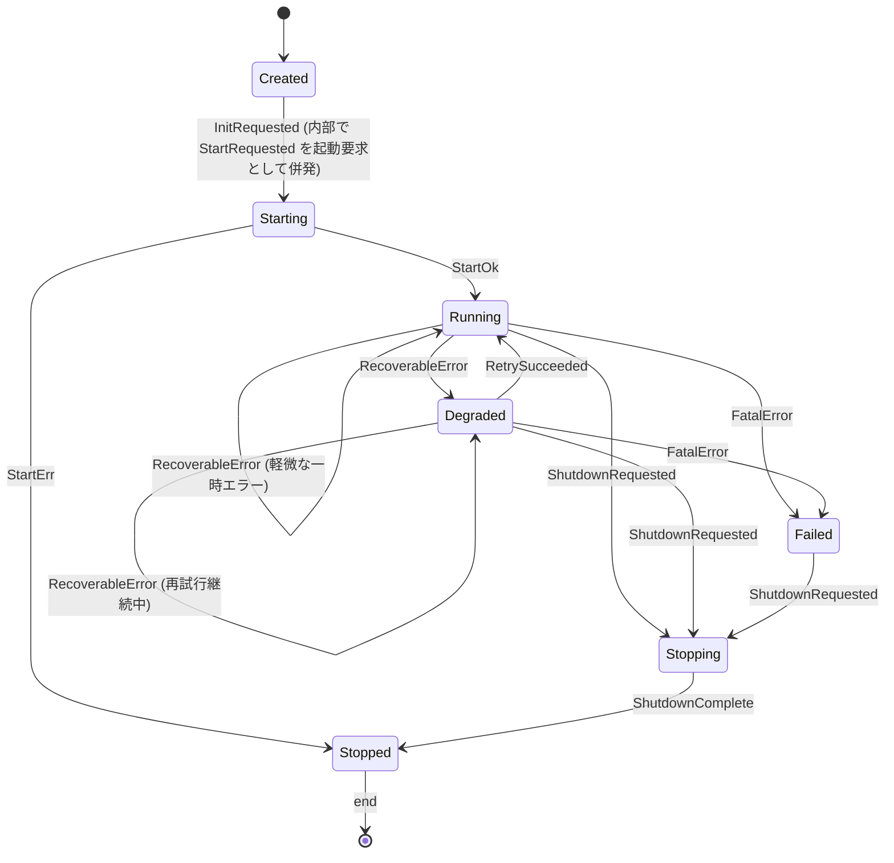

# RFC-20260307-001 Transport State Machine

- RFC ID: `RFC-20260307-001`
- タイトル: `Transport State Machine & Lifecycle`
- 作成者: `NekoCool`
- ステータス: `Review`
- 対象crate: `rgz-transport`
- 関連Issue: `#23`
- 想定リリース: `v0.2.x`

## 1. 背景

`rgz-transport` の既存実装は `thread + poll` ベースで状態管理が暗黙的で、起動失敗・再接続・停止時のふるまいが仕様化されていない。
`Issue #23` では、`Transporter` を中心とした非同期アーキテクチャ移行の前提として、明示的な状態遷移を定義し、実装とテストを同期させる。

## 2. 目標 / 非目標

### 目標

- `rgz-transport` の transport ループの状態を以下で明示する: `Created`, `Starting`, `Running`, `Degraded`, `Stopping`, `Stopped`, `Failed`
- `Recoverable` と `Non-recoverable` の失敗経路を分離する
- `Degraded` 復帰条件・停止条件を決定論的に扱う
- 状態遷移をテスト可能にする

### 非目標

- 今回は `rgz-msgs`, `rgz-derive` の API/挙動変更は扱わない
- パフォーマンス最適化（バッチング、ソケットチューニング、プロトコル最適化）は別Issueで行う

## 3. 状態定義

```text
Created:     初期化済み、まだstartが走っていない
Starting:    非同期actor/task起動中、初期化・接続確立中
Running:     正常運用中
Degraded:    一部の送受信/接続で再試行可能な不具合が発生中
Stopping:    停止要求受理、クリーンアップ開始
Stopped:     停止完了（再起動は新インスタンスを作成）
Failed:      回復不能エラーにより停止に至った状態
```

## 4. イベント定義

- `InitRequested`: 初期化開始
- `StartRequested`: スレッド/タスク起動要求
- `StartOk`: 初期化成功（binding/connect 初期化完了）
- `StartErr`: 初期化失敗
- `RecoverableError`: 一時的エラー（ネットワーク断・一時送信失敗等）
- `FatalError`: 回復不能エラー
- `RetrySucceeded`: デグレード条件を解消
- `ShutdownRequested`: 停止要求
- `ShutdownComplete`: 停止完了

## 5. 状態遷移図



## 6. 禁止遷移

- `Stopped -> Running`（再起動は新インスタンス）
- `Created -> Running`（`Starting` を経由）
- `Created -> Stopped`（直接停止は許容しない。`Stopping`経由を要求）
- `Running -> Failed` は `FatalError` のみ（`RecoverableError` は `Degraded`）

## 7. 状態遷移ルール（実装規則）

- すべての状態更新は `transition(current_state, event) -> (next_state, effects)` の単一関数で行う
- 複数イベント同時到着時はイベント処理順を固定（`ShutdownRequested` を最優先）
- `Degraded` は `recoverable_error_count` と `last_recovered_at` を保有
  - `recoverable_error_count >= 3` かつ `5秒以内に再試行継続` で `Failed` に遷移
  - `RetrySucceeded` を連続N回受理（初期値: 3回）で `Running` に復帰
- `Failed` は必ず `ShutdownRequested` で `Stopping` へ遷移（外部依存のリソース解放を確定）

## 8. 実装マッピング（暫定）

- 状態管理: `crates/rgz-transport/src/transport.rs`（または `transport/state.rs` を新設）
- イベント生成: transport 内部イベントループ
- 監視: `tracing` + メトリクス

## 9. テスト計画
### 9.1 単体テスト（最優先）
- 目的: 状態遷移ロジックの正しさを決定論的に検証する。
- 対象: `transition(state, event) -> next_state, actions`
- テスト項目（必須）
  - `Created -> Starting -> Running`（正常起動）
  - `Starting -> Stopped`（StartErr）
  - `Running -> Degraded`（RecoverableError）
  - `Running -> Failed`（FatalError）
  - `Degraded -> Running`（RetrySucceeded）
  - `Degraded -> Failed`（recoverable error 閾値到達時、またはスロットリング限度超過時）
  - 禁止遷移: `Stopped -> Running`, `Created -> Running`

### 9.2 統合テスト
- 目的: 実イベントで状態遷移が実装どおり起こることを確認。
- シナリオ（各1件）
  1. 起動シナリオ: `Created -> Starting -> Running`
  2. 一時障害シナリオ: `Running -> Degraded -> Running`
  3. 送受信フロー中の recoverable error 注入シナリオ: `Running -> Degraded`
  4. 致命エラーシナリオ: `Running -> Failed -> Stopping -> Stopped`
  5. 終了優先順位シナリオ: `ShutdownRequested` が他イベントより優先される
- 検証: 5シナリオでクラッシュなし、最終状態が期待どおり。

### 9.3 ログ/監視
- 最低限の監視ログを確認
  - 状態遷移ログ（`from -> to`）
  - `Stopped` 到達までの経路
  - 必須ではないが、後続Issueでmetrics追加へ拡張
 
### 9.4 メトリクス

- `rgz_transport_state{state}`
- `rgz_transport_transition_total{from,to,event}`
- `rgz_transport_degraded_duration_seconds`
- `rgz_transport_shutdown_latency_seconds`

### 9.5 テスト完了条件（DoD）
- 上記の単体テストが PASS
- 上記5統合シナリオが PASS
- 禁止遷移テストが PASS
- Issue #23 の実装とテストコードをコミット可能な状態にする

## 10. DoD（Issue #23 完了条件）
- [ ] 状態遷移仕様を本RFCとして確定
- [ ] Mermaid図を含む状態定義がレビュー可能
- [ ] `TransportEvent`/`TransportState` と `transition` 実装を追加
- [ ] 禁止遷移がテストで検証される
- [ ] `Degraded`/`Failed`/`Stopped` への遷移観測が自動テストで再現される
- [ ] `transport rewrite roadmap (#22)` へ反映コメントを追加
